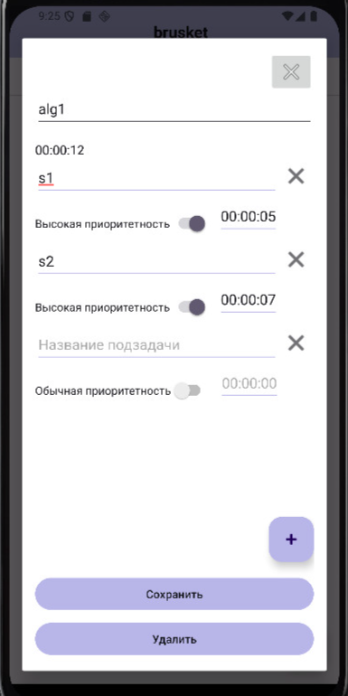
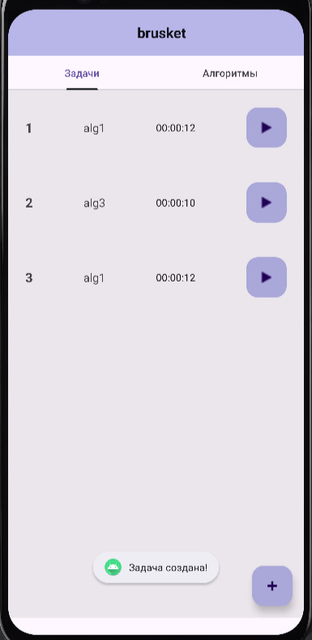
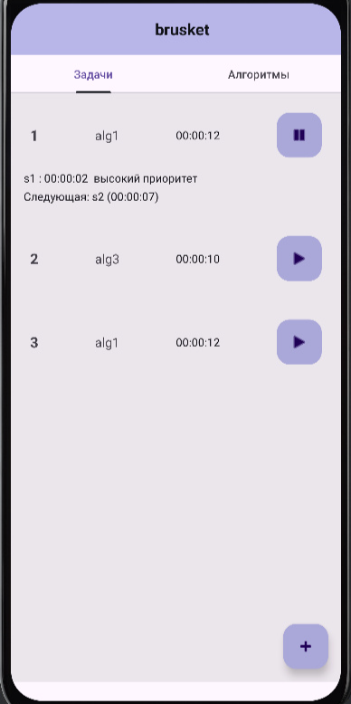

# ⏱️ TaskTimer — Алгоритмический таймер для Android

TaskTimer — это Android-приложение, которое позволяет создавать задачи на основе кастомных алгоритмов с подзадачами и управлять ими в реальном времени.  
Таймер работает в фоне, поддерживает разные приоритеты, уведомления и гибкое редактирование алгоритмов.

---

## 🧩 Особенности

- 🔁 Переключение между экранами **задачами** и **алгоритмами** свайпом
- ➕ Создание и редактирование **алгоритмов** с подзадачами
- ⏳ Таймер с **обратным отсчётом** по каждой подзадаче
- 🔔 Разные **звуковые сигналы** для высокого приоритета
- 📲 Постоянные **уведомления**, которые нельзя смахнуть
- 🔄 Таймер продолжает работу в **фоновом режиме**
- 🚦 Управление задачами: запуск, пауза, удаление
- 📦 Поддержка нескольких параллельных задач

---

## 🖼️ Интерфейс

| Создание алгоритма | Подзадачи алгоритма | Задачи | Запущенная задача |
|--------------------|----------------------|--------|--------------------|
|  |  |  |  |

---

## 🧠 Архитектура

Проект реализован с использованием архитектурного паттерна **MVVM** с разделением на следующие слои:

- **model/** — бизнес-сущности (`Task`, `Subtask`, `Algorithm`) и сервисы (`TaskTimerService`)
- **repository/** — логика управления алгоритмами и задачами
- **viewmodel/** — хранит состояние и бизнес-логику представления
- **view/** — UI-слой: фрагменты, адаптеры, диалоговые окна
- **utils/** — вспомогательные классы, работа с временем и будильником

---

## 🔧 Техническая реализация

- 📱 Написано на **Kotlin**
- 🧱 Использован **MVVM-подход**
- 🔔 Работа с **AlarmManager** и **Foreground Service**
- 📦 Работа в фоне с учётом **Android ограничений (API ≥ 26)**
- 🧮 Обработка времени с помощью `CountDownTimer` и кастомной логики
- ☑️ Валидация при создании задач и алгоритмов

---

## 🚀 Возможности

| Функция                           | Поддержка |
|----------------------------------|-----------|
| Создание/редактирование алгоритмов | ✅        |
| Добавление подзадач               | ✅        |
| Отслеживание времени              | ✅        |
| Звук по приоритету подзадачи     | ✅        |
| Постоянное уведомление           | ✅        |
| Многозадачность                  | ✅        |
| Поддержка паузы и возобновления  | ✅        |

---

## 📌 TODO (в будущем)

- [ ] Улучшенная архитектура
- [ ] Интеграция Jetpack Compose
- [ ] Экспорт/импорт алгоритмов
- [ ] Улучшенный UI

---

